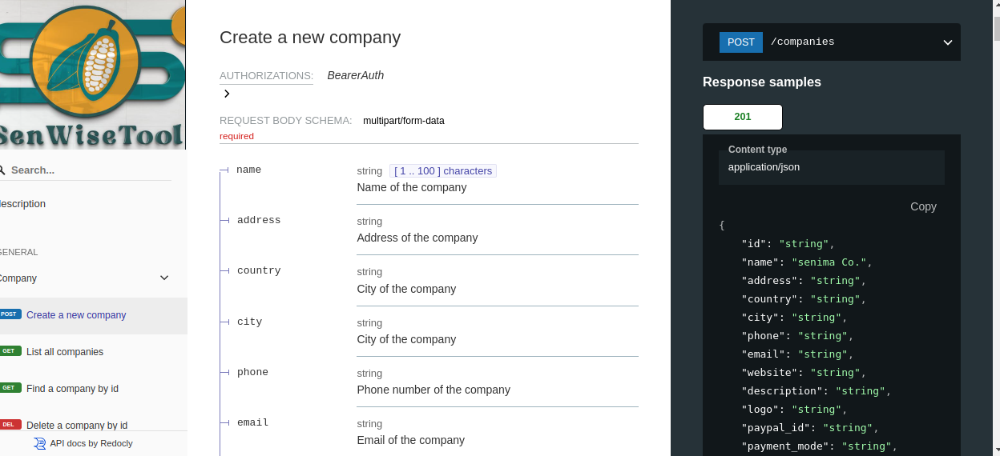

# Senwisetool REST API Specifications



__This repository contains the specification files for  senwisetool REST APIs.__

__table of content__

- [local setup](#setup-repo-locally)
- [how to render the](#how-to-render-the-documentation)
- [API tags](#api-tags)

## setup repo locally

- Clone repo with

  ```bash
    git clone git@github.com:frckbrice/senwisetool-api_spec.git
  ```

- Navigate to project : the target is to access the senwisetool.yaml file for build.

  ```bash
    cd senwisetool-api_spec/swt_api_spec
  ```

## How to render the documentation

<!-- - Install Redoc CLI with the command `npm i redoc-cli -g` -->

- Start local server for the spec in watch mode (you could just enter cd swt_api_apec && redocly build-docs senwisetool.yaml)

    ```bash
      - npm install -g @redocly/cli@latest
      - redocly build-docs senwisetool.yaml
      - redocly preview-docs senwisetool.yaml
    ```
- after the preview on client finished build, you can follow the displayed link to browser and Voila.
## Available scripts
  ```bash
     npm run
    Scripts available in @swt/senwisetool-rest-api-specifications@1.0.0 via `npm run-script`:
      preview
        redocly preview-docs
      bundle
        redocly bundle
      bundle-deref
        redocly bundle -d true
      lint-redocly
        redocly --format summary lint
  ```
## Available specifications


### OpenAPI 3.0.3

  The [OpenAPI](https://swagger.io/specification/v3/) specification is a programming language agnostic standard that lets providers describe the interface of their HTTP APIs. This allows both humans and machines to discover the capabilities of an API without needing to first read documentation or understand the implementation.
   
  | API Name              | Version |
  |-----------------------|---------|
  | Users                 | v1      |                      
  | Projects              | v1      |                           |
  | Subscriptions         | v1      |
  | Farms                 | v1      |
  | Training              | v1      | 
  | Companies             | v1      | 
  | Markets               | v1      | 
  | Transactions          | v1      | 
  | project_audits        | v1      |
  | Collector_agents      | v1      | 
  | Farm_coordinates      | v1      | 
  | Requirements          | v1      | 
  | Price_plan            | v2      |
  | Campaigns             | v1      | 
  | Stock_campaigns       | v1      | 
                         
### WIP (Work in Progress)

**Thanks 🚀**
